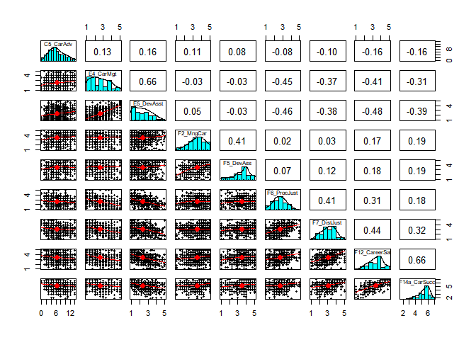

### Descriptives for Career Facilitator Scales

#### Cronbach alpha and number of items for 7-point scales:
<table class="table table-striped table-hover" style="width: auto !important; margin-left: auto; margin-right: auto;">
 <thead>
  <tr>
   <th style="text-align:left;"> ScaleNames7 </th>
   <th style="text-align:right;"> alpha_7 </th>
   <th style="text-align:right;"> n_items_7 </th>
  </tr>
 </thead>
<tbody>
  <tr>
   <td style="text-align:left;"> D3_CareerSE </td>
   <td style="text-align:right;"> 0.79 </td>
   <td style="text-align:right;"> 4 </td>
  </tr>
  <tr>
   <td style="text-align:left;"> F13_LifeSat </td>
   <td style="text-align:right;"> 0.89 </td>
   <td style="text-align:right;"> 5 </td>
  </tr>
  <tr>
   <td style="text-align:left;"> F14a_CarSucc </td>
   <td style="text-align:right;"> 0.84 </td>
   <td style="text-align:right;"> 3 </td>
  </tr>
</tbody>
</table>
#### Cronbach alpha and number of items for 5-point scales:
<table class="table table-striped table-hover" style="width: auto !important; margin-left: auto; margin-right: auto;">
 <thead>
  <tr>
   <th style="text-align:left;"> ScaleNames5 </th>
   <th style="text-align:right;"> alpha_vals </th>
   <th style="text-align:right;"> N_items </th>
  </tr>
 </thead>
<tbody>
  <tr>
   <td style="text-align:left;"> C2_WLB </td>
   <td style="text-align:right;"> 0.77 </td>
   <td style="text-align:right;"> 5 </td>
  </tr>
  <tr>
   <td style="text-align:left;"> D1_PersCirc </td>
   <td style="text-align:right;"> 0.63 </td>
   <td style="text-align:right;"> 5 </td>
  </tr>
  <tr>
   <td style="text-align:left;"> D2_Abilities </td>
   <td style="text-align:right;"> 0.87 </td>
   <td style="text-align:right;"> 8 </td>
  </tr>
  <tr>
   <td style="text-align:left;"> E1_CultFit </td>
   <td style="text-align:right;"> 0.87 </td>
   <td style="text-align:right;"> 7 </td>
  </tr>
  <tr>
   <td style="text-align:left;"> E2_Network </td>
   <td style="text-align:right;"> 0.85 </td>
   <td style="text-align:right;"> 2 </td>
  </tr>
  <tr>
   <td style="text-align:left;"> E3_Mentor </td>
   <td style="text-align:right;"> 0.87 </td>
   <td style="text-align:right;"> 4 </td>
  </tr>
  <tr>
   <td style="text-align:left;"> E4_CarMgt </td>
   <td style="text-align:right;"> 0.86 </td>
   <td style="text-align:right;"> 3 </td>
  </tr>
  <tr>
   <td style="text-align:left;"> E5_DevAsst </td>
   <td style="text-align:right;"> 0.92 </td>
   <td style="text-align:right;"> 7 </td>
  </tr>
  <tr>
   <td style="text-align:left;"> E6_GeoMob </td>
   <td style="text-align:right;"> 0.80 </td>
   <td style="text-align:right;"> 3 </td>
  </tr>
  <tr>
   <td style="text-align:left;"> F2_MngCar </td>
   <td style="text-align:right;"> 0.82 </td>
   <td style="text-align:right;"> 4 </td>
  </tr>
  <tr>
   <td style="text-align:left;"> F3_Relships </td>
   <td style="text-align:right;"> 0.82 </td>
   <td style="text-align:right;"> 4 </td>
  </tr>
  <tr>
   <td style="text-align:left;"> F4_Mentor </td>
   <td style="text-align:right;"> 0.94 </td>
   <td style="text-align:right;"> 8 </td>
  </tr>
  <tr>
   <td style="text-align:left;"> F5_DevAss </td>
   <td style="text-align:right;"> 0.89 </td>
   <td style="text-align:right;"> 4 </td>
  </tr>
  <tr>
   <td style="text-align:left;"> F6_ProcJust </td>
   <td style="text-align:right;"> 0.75 </td>
   <td style="text-align:right;"> 5 </td>
  </tr>
  <tr>
   <td style="text-align:left;"> F7_DistJust </td>
   <td style="text-align:right;"> 0.81 </td>
   <td style="text-align:right;"> 5 </td>
  </tr>
  <tr>
   <td style="text-align:left;"> F8_Empower </td>
   <td style="text-align:right;"> 0.81 </td>
   <td style="text-align:right;"> 4 </td>
  </tr>
  <tr>
   <td style="text-align:left;"> F9_DevAss </td>
   <td style="text-align:right;"> 0.87 </td>
   <td style="text-align:right;"> 3 </td>
  </tr>
  <tr>
   <td style="text-align:left;"> F10_Turnover </td>
   <td style="text-align:right;"> 0.94 </td>
   <td style="text-align:right;"> 4 </td>
  </tr>
  <tr>
   <td style="text-align:left;"> F11_JobSat </td>
   <td style="text-align:right;"> 0.87 </td>
   <td style="text-align:right;"> 5 </td>
  </tr>
  <tr>
   <td style="text-align:left;"> F12_CareerSat </td>
   <td style="text-align:right;"> 0.88 </td>
   <td style="text-align:right;"> 5 </td>
  </tr>
</tbody>
</table>

#### CFA chi-sq and fit values for scales:
<table class="table table-striped table-hover" style="width: auto !important; margin-left: auto; margin-right: auto;">
<caption>CFA fit for scales using 5-point rating scale</caption>
 <thead>
  <tr>
   <th style="text-align:left;"> name </th>
   <th style="text-align:right;"> chisq </th>
   <th style="text-align:right;"> df </th>
   <th style="text-align:right;"> ntotal </th>
   <th style="text-align:right;"> cfi </th>
   <th style="text-align:right;"> tli </th>
   <th style="text-align:right;"> rmsea </th>
   <th style="text-align:right;"> srmr </th>
  </tr>
 </thead>
<tbody>
  <tr>
   <td style="text-align:left;"> WLB </td>
   <td style="text-align:right;"> 56.701 </td>
   <td style="text-align:right;"> 5 </td>
   <td style="text-align:right;"> 885 </td>
   <td style="text-align:right;"> 0.962 </td>
   <td style="text-align:right;"> 0.924 </td>
   <td style="text-align:right;"> 0.108 </td>
   <td style="text-align:right;"> 0.038 </td>
  </tr>
  <tr>
   <td style="text-align:left;"> PersCirc </td>
   <td style="text-align:right;"> 58.770 </td>
   <td style="text-align:right;"> 5 </td>
   <td style="text-align:right;"> 857 </td>
   <td style="text-align:right;"> 0.895 </td>
   <td style="text-align:right;"> 0.790 </td>
   <td style="text-align:right;"> 0.112 </td>
   <td style="text-align:right;"> 0.056 </td>
  </tr>
  <tr>
   <td style="text-align:left;"> Abilities </td>
   <td style="text-align:right;"> 1061.428 </td>
   <td style="text-align:right;"> 20 </td>
   <td style="text-align:right;"> 852 </td>
   <td style="text-align:right;"> 0.703 </td>
   <td style="text-align:right;"> 0.584 </td>
   <td style="text-align:right;"> 0.247 </td>
   <td style="text-align:right;"> 0.097 </td>
  </tr>
  <tr>
   <td style="text-align:left;"> CultFit </td>
   <td style="text-align:right;"> 166.671 </td>
   <td style="text-align:right;"> 14 </td>
   <td style="text-align:right;"> 780 </td>
   <td style="text-align:right;"> 0.934 </td>
   <td style="text-align:right;"> 0.901 </td>
   <td style="text-align:right;"> 0.118 </td>
   <td style="text-align:right;"> 0.043 </td>
  </tr>
  <tr>
   <td style="text-align:left;"> Network </td>
   <td style="text-align:right;"> NA </td>
   <td style="text-align:right;"> -1 </td>
   <td style="text-align:right;"> 791 </td>
   <td style="text-align:right;"> NA </td>
   <td style="text-align:right;"> NA </td>
   <td style="text-align:right;"> NA </td>
   <td style="text-align:right;"> 0.000 </td>
  </tr>
  <tr>
   <td style="text-align:left;"> Mentor </td>
   <td style="text-align:right;"> 0.982 </td>
   <td style="text-align:right;"> 2 </td>
   <td style="text-align:right;"> 787 </td>
   <td style="text-align:right;"> 1.000 </td>
   <td style="text-align:right;"> 1.002 </td>
   <td style="text-align:right;"> 0.000 </td>
   <td style="text-align:right;"> 0.004 </td>
  </tr>
  <tr>
   <td style="text-align:left;"> CarMgt </td>
   <td style="text-align:right;"> 0.000 </td>
   <td style="text-align:right;"> 0 </td>
   <td style="text-align:right;"> 790 </td>
   <td style="text-align:right;"> 1.000 </td>
   <td style="text-align:right;"> 1.000 </td>
   <td style="text-align:right;"> 0.000 </td>
   <td style="text-align:right;"> 0.000 </td>
  </tr>
  <tr>
   <td style="text-align:left;"> DevAsst </td>
   <td style="text-align:right;"> 294.739 </td>
   <td style="text-align:right;"> 14 </td>
   <td style="text-align:right;"> 772 </td>
   <td style="text-align:right;"> 0.927 </td>
   <td style="text-align:right;"> 0.890 </td>
   <td style="text-align:right;"> 0.161 </td>
   <td style="text-align:right;"> 0.048 </td>
  </tr>
  <tr>
   <td style="text-align:left;"> GeoMob </td>
   <td style="text-align:right;"> 0.000 </td>
   <td style="text-align:right;"> 0 </td>
   <td style="text-align:right;"> 776 </td>
   <td style="text-align:right;"> 1.000 </td>
   <td style="text-align:right;"> 1.000 </td>
   <td style="text-align:right;"> 0.000 </td>
   <td style="text-align:right;"> 0.000 </td>
  </tr>
  <tr>
   <td style="text-align:left;"> MngCar </td>
   <td style="text-align:right;"> 83.139 </td>
   <td style="text-align:right;"> 2 </td>
   <td style="text-align:right;"> 697 </td>
   <td style="text-align:right;"> 0.921 </td>
   <td style="text-align:right;"> 0.764 </td>
   <td style="text-align:right;"> 0.241 </td>
   <td style="text-align:right;"> 0.052 </td>
  </tr>
  <tr>
   <td style="text-align:left;"> Relships </td>
   <td style="text-align:right;"> 13.052 </td>
   <td style="text-align:right;"> 2 </td>
   <td style="text-align:right;"> 698 </td>
   <td style="text-align:right;"> 0.988 </td>
   <td style="text-align:right;"> 0.965 </td>
   <td style="text-align:right;"> 0.089 </td>
   <td style="text-align:right;"> 0.020 </td>
  </tr>
  <tr>
   <td style="text-align:left;"> Mentor </td>
   <td style="text-align:right;"> 243.902 </td>
   <td style="text-align:right;"> 20 </td>
   <td style="text-align:right;"> 685 </td>
   <td style="text-align:right;"> 0.950 </td>
   <td style="text-align:right;"> 0.930 </td>
   <td style="text-align:right;"> 0.128 </td>
   <td style="text-align:right;"> 0.033 </td>
  </tr>
  <tr>
   <td style="text-align:left;"> DevAss </td>
   <td style="text-align:right;"> 81.120 </td>
   <td style="text-align:right;"> 2 </td>
   <td style="text-align:right;"> 694 </td>
   <td style="text-align:right;"> 0.954 </td>
   <td style="text-align:right;"> 0.861 </td>
   <td style="text-align:right;"> 0.239 </td>
   <td style="text-align:right;"> 0.039 </td>
  </tr>
  <tr>
   <td style="text-align:left;"> ProcJust </td>
   <td style="text-align:right;"> 148.982 </td>
   <td style="text-align:right;"> 5 </td>
   <td style="text-align:right;"> 696 </td>
   <td style="text-align:right;"> 0.834 </td>
   <td style="text-align:right;"> 0.667 </td>
   <td style="text-align:right;"> 0.203 </td>
   <td style="text-align:right;"> 0.084 </td>
  </tr>
  <tr>
   <td style="text-align:left;"> DistJust </td>
   <td style="text-align:right;"> 51.781 </td>
   <td style="text-align:right;"> 5 </td>
   <td style="text-align:right;"> 688 </td>
   <td style="text-align:right;"> 0.957 </td>
   <td style="text-align:right;"> 0.915 </td>
   <td style="text-align:right;"> 0.117 </td>
   <td style="text-align:right;"> 0.038 </td>
  </tr>
  <tr>
   <td style="text-align:left;"> Empower </td>
   <td style="text-align:right;"> 0.039 </td>
   <td style="text-align:right;"> 2 </td>
   <td style="text-align:right;"> 694 </td>
   <td style="text-align:right;"> 1.000 </td>
   <td style="text-align:right;"> 1.005 </td>
   <td style="text-align:right;"> 0.000 </td>
   <td style="text-align:right;"> 0.001 </td>
  </tr>
  <tr>
   <td style="text-align:left;"> DevAss </td>
   <td style="text-align:right;"> 0.000 </td>
   <td style="text-align:right;"> 0 </td>
   <td style="text-align:right;"> 695 </td>
   <td style="text-align:right;"> 1.000 </td>
   <td style="text-align:right;"> 1.000 </td>
   <td style="text-align:right;"> 0.000 </td>
   <td style="text-align:right;"> 0.000 </td>
  </tr>
  <tr>
   <td style="text-align:left;"> Turnover </td>
   <td style="text-align:right;"> 92.474 </td>
   <td style="text-align:right;"> 2 </td>
   <td style="text-align:right;"> 695 </td>
   <td style="text-align:right;"> 0.967 </td>
   <td style="text-align:right;"> 0.901 </td>
   <td style="text-align:right;"> 0.255 </td>
   <td style="text-align:right;"> 0.023 </td>
  </tr>
  <tr>
   <td style="text-align:left;"> JobSat </td>
   <td style="text-align:right;"> 57.550 </td>
   <td style="text-align:right;"> 5 </td>
   <td style="text-align:right;"> 701 </td>
   <td style="text-align:right;"> 0.969 </td>
   <td style="text-align:right;"> 0.938 </td>
   <td style="text-align:right;"> 0.122 </td>
   <td style="text-align:right;"> 0.035 </td>
  </tr>
  <tr>
   <td style="text-align:left;"> CareerSat </td>
   <td style="text-align:right;"> 34.362 </td>
   <td style="text-align:right;"> 5 </td>
   <td style="text-align:right;"> 701 </td>
   <td style="text-align:right;"> 0.985 </td>
   <td style="text-align:right;"> 0.969 </td>
   <td style="text-align:right;"> 0.092 </td>
   <td style="text-align:right;"> 0.022 </td>
  </tr>
</tbody>
</table>


<table class="table table-striped table-hover" style="width: auto !important; margin-left: auto; margin-right: auto;">
<caption>CFA fit for scales using 7-point rating scale</caption>
 <thead>
  <tr>
   <th style="text-align:left;"> name </th>
   <th style="text-align:right;"> chisq </th>
   <th style="text-align:right;"> df </th>
   <th style="text-align:right;"> ntotal </th>
   <th style="text-align:right;"> cfi </th>
   <th style="text-align:right;"> tli </th>
   <th style="text-align:right;"> rmsea </th>
   <th style="text-align:right;"> srmr </th>
  </tr>
 </thead>
<tbody>
  <tr>
   <td style="text-align:left;"> CareerSE </td>
   <td style="text-align:right;"> 32.985 </td>
   <td style="text-align:right;"> 2 </td>
   <td style="text-align:right;"> 861 </td>
   <td style="text-align:right;"> 0.971 </td>
   <td style="text-align:right;"> 0.914 </td>
   <td style="text-align:right;"> 0.134 </td>
   <td style="text-align:right;"> 0.033 </td>
  </tr>
  <tr>
   <td style="text-align:left;"> LifeSat </td>
   <td style="text-align:right;"> 59.693 </td>
   <td style="text-align:right;"> 5 </td>
   <td style="text-align:right;"> 699 </td>
   <td style="text-align:right;"> 0.975 </td>
   <td style="text-align:right;"> 0.949 </td>
   <td style="text-align:right;"> 0.125 </td>
   <td style="text-align:right;"> 0.030 </td>
  </tr>
  <tr>
   <td style="text-align:left;"> CarSucc </td>
   <td style="text-align:right;"> 0.000 </td>
   <td style="text-align:right;"> 0 </td>
   <td style="text-align:right;"> 700 </td>
   <td style="text-align:right;"> 1.000 </td>
   <td style="text-align:right;"> 1.000 </td>
   <td style="text-align:right;"> 0.000 </td>
   <td style="text-align:right;"> 0.000 </td>
  </tr>
</tbody>
</table>

#### Summary stats for demog vars

```r
skim(responses, Age, Seniority, Educ, TotSal, WkHours, TotDeps) %>% 
    kable()
```

Skim summary statistics  
 n obs: 1050    
 n variables: 247    

Variable type: integer

variable    missing   complete   n      mean   sd     p0   p25   median   p75   p100   hist                                                             
----------  --------  ---------  -----  -----  -----  ---  ----  -------  ----  -----  -----------------------------------------------------------------
Age         52        998        1050   3.05   1.08   1    2     3        4     6      <U+2581><U+2586><U+2581><U+2587><U+2585><U+2581><U+2582><U+2581> 
Educ        122       928        1050   3.49   1.41   1    2     4        4     7      <U+2582><U+2586><U+2586><U+2587><U+2581><U+2583><U+2582><U+2581> 
Seniority   122       928        1050   5.59   2.28   1    4     6        8     8      <U+2581><U+2581><U+2583><U+2583><U+2582><U+2582><U+2582><U+2587> 
TotDeps     34        1016       1050   0.87   1.24   0    0     0        2     20     <U+2587><U+2581><U+2581><U+2581><U+2581><U+2581><U+2581><U+2581> 
TotSal      123       927        1050   3.75   1.28   1    3     4        5     7      <U+2581><U+2583><U+2587><U+2585><U+2581><U+2587><U+2581><U+2581> 
WkHours     57        993        1050   3.63   1.02   1    3     4        4     6      <U+2581><U+2581><U+2581><U+2583><U+2587><U+2581><U+2582><U+2581> 


The following tables use pairs.panels (first fig) and corPlot from psych package.

<!-- --><!-- -->

The package skimr provides tidy one-line summaries of response frequencies.


