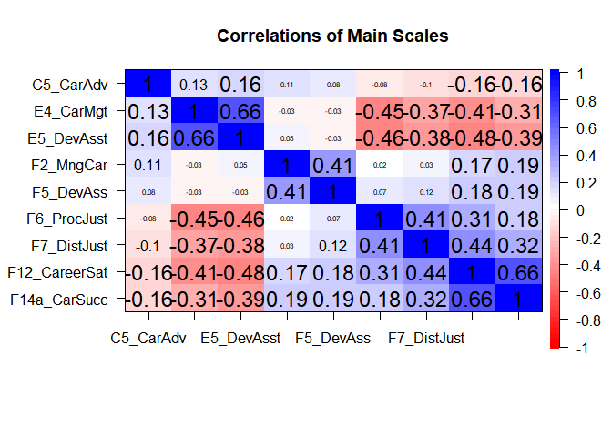

### Descriptives for Career Facilitator Scales

#### Cronbach alpha and number of items for 7-point scales:
<table style="border-collapse:collapse; border:none;">
<caption style="font-weight: bold; text-align:left;">Alpha for 7-point Scales</caption>
<tr>
<th style="border-top: double; text-align:center; font-style:italic; font-weight:normal; padding:0.2cm; border-bottom:1px solid black; ">Variable</th>
<th style="border-top: double; text-align:center; font-style:italic; font-weight:normal; padding:0.2cm; border-bottom:1px solid black;">alpha</th>
</tr>
<tr>
<td style="padding:0.2cm; text-align:left; vertical-align:top; text-align:left; ">D3_CareerSE</td>
<td style="padding:0.2cm; text-align:left; vertical-align:top; text-align:center;">0.79</td>
</tr>
<tr>
<td style="padding:0.2cm; text-align:left; vertical-align:top; text-align:left; ">F13_LifeSat</td>
<td style="padding:0.2cm; text-align:left; vertical-align:top; text-align:center;">0.89</td>
</tr>
<tr>
<td style="padding:0.2cm; text-align:left; vertical-align:top; text-align:left; ">F14a_CarSucc</td>
<td style="padding:0.2cm; text-align:left; vertical-align:top; text-align:center;">0.84</td>
</tr>
</table>
<table style="border-collapse:collapse; border:none;">
<caption style="font-weight: bold; text-align:left;">Number of items in 7-point Scales</caption>
<tr>
<th style="border-top: double; text-align:center; font-style:italic; font-weight:normal; padding:0.2cm; border-bottom:1px solid black; ">Variable</th>
<th style="border-top: double; text-align:center; font-style:italic; font-weight:normal; padding:0.2cm; border-bottom:1px solid black;">scores_7$n.items[-1]</th>
</tr>
<tr>
<td style="padding:0.2cm; text-align:left; vertical-align:top; text-align:left; ">D3_CareerSE</td>
<td style="padding:0.2cm; text-align:left; vertical-align:top; text-align:center;">4</td>
</tr>
<tr>
<td style="padding:0.2cm; text-align:left; vertical-align:top; text-align:left; ">F13_LifeSat</td>
<td style="padding:0.2cm; text-align:left; vertical-align:top; text-align:center;">5</td>
</tr>
<tr>
<td style="padding:0.2cm; text-align:left; vertical-align:top; text-align:left; ">F14a_CarSucc</td>
<td style="padding:0.2cm; text-align:left; vertical-align:top; text-align:center;">3</td>
</tr>
</table>
#### Cronbach alpha and number of items for 5-point scales:

```
##        C2_WLB   D1_PersCirc  D2_Abilities    E1_CultFit    E2_Network 
##          0.77          0.63          0.87          0.87          0.85 
##     E3_Mentor     E4_CarMgt    E5_DevAsst     E6_GeoMob     F2_MngCar 
##          0.87          0.86          0.92          0.80          0.82 
##   F3_Relships     F4_Mentor     F5_DevAss   F6_ProcJust   F7_DistJust 
##          0.82          0.94          0.89          0.75          0.81 
##    F8_Empower     F9_DevAss  F10_Turnover    F11_JobSat F12_CareerSat 
##          0.81          0.87          0.94          0.87          0.88
```

```
##        C2_WLB   D1_PersCirc  D2_Abilities    E1_CultFit    E2_Network 
##             5             5             8             7             2 
##     E3_Mentor     E4_CarMgt    E5_DevAsst     E6_GeoMob     F2_MngCar 
##             4             3             7             3             4 
##   F3_Relships     F4_Mentor     F5_DevAss   F6_ProcJust   F7_DistJust 
##             4             8             4             5             5 
##    F8_Empower     F9_DevAss  F10_Turnover    F11_JobSat F12_CareerSat 
##             4             3             4             5             5
```


The following tables use pairs.panels (first fig) and corPlot from psych package.

<!-- --><!-- -->


